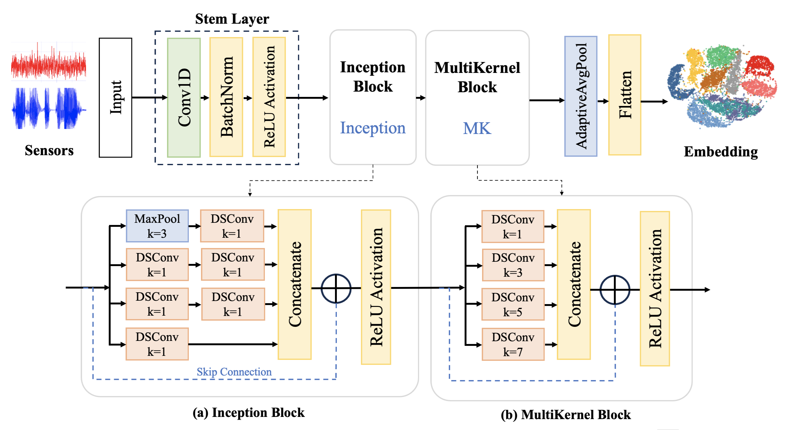

# InceptionMK
**(paper source) Geometric Self-Supervised Learning for HAR using Inception with Multi-Kernel Convolutions (https://github.com/lky473736/InceptionMK.git)**

<p align="center"></p>

This repository implements the methodology proposed in the paper **Geometric Self-Supervised Learning for HAR using Inception with Multi-Kernel Convolutions**.

## Datasets

The system works with four popular HAR datasets.

1. **UCI HAR Dataset**: Contains data from smartphone sensors for 6 activities.
   - Download: https://archive.ics.uci.edu/ml/datasets/human+activity+recognition+using+smartphones

2. **WISDM Dataset**: Contains accelerometer data from smartphones for 6 physical activities.
   - Download: https://www.cis.fordham.edu/wisdm/dataset.php

3. **PAMAP2 Dataset**: Physical Activity Monitoring dataset with data from 18 different physical activities. (At this 12.)
   - Download: https://archive.ics.uci.edu/ml/datasets/pamap2+physical+activity+monitoring

4. **mHealth Dataset**: Contains data from body-worn sensors for 12 physical activities.
   - Download: https://archive.ics.uci.edu/ml/datasets/mhealth+dataset

## Model Architecture

<p align="center"></p>

- Stem Layer: Conv1D + BatchNorm + ReLU to extract initial local features.

- Inception Block: Parallel depthwise separable convolutions and max pooling to capture multi-scale temporal features.

- Multi-Kernel Block: Additional depthwise separable convolutions with various kernel sizes (1, 3, 5, 7) for diverse receptive fields.

- Adaptive Average Pooling + Flatten: Global feature summarization.

- Embedding Layer: Latent embedding projection for downstream tasks.

- Dual Heads:
    - Activity Classification Head (main task)
    - Rotation Angle Classification Head (self-supervised pretext task)

## Citing this Repository

If you use this code in your research, please cite:

```
@article{Lim2025inceptionmk,
  title = {Geometric Self-Supervised Learning for HAR using Inception with Multi-Kernel Convolutions},
  author={Gyuyeon Lim and Myung-Kyu Yi},
  journal={},
  volume={},
  pages={},
  year={2025}
}

```

## Contact

For questions or issues, please contact
- Gyuyeon Lim : lky473736@gmail.com

## License

This project is licensed under the MIT License - see the [LICENSE](LICENSE) file for details.
